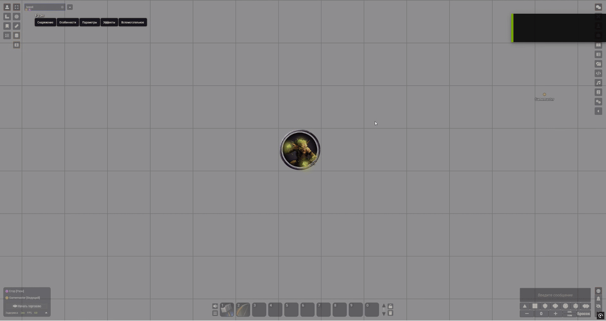

# Token Floaty Numbers Control
Allows you to control who can see floating damage and healing numbers near tokens, and selectively hide damage or healing values for different users.

## Example: Healing numbers hidden for players
GMView

PlayerView

